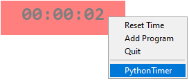

Based on the timer created by: [**NEIL CICIEREGA**](https://neilblr.com/post/58757345346), but using python.

# How To Use 📖

When you right-click on the timer, a menu will appear presenting three options:

- Reset Time
- Add Program
- Quit

## Reset Time

Timer will go back to 00:00:00.

## Add Program

After selecting this option, a message saying 'Waiting' will appear. Navigate to the desired application you wish to add and wait until the message disappears. The timer will then commence, allowing you to add multiple applications in a similar manner.

 

Right-click on the timer again to check if the application was added correctly.

If the currently active application is not on the list, the timer will pause.

## Quit

You can quit the timer by clicking this option or by pressing 'ESC' on your keyboard.